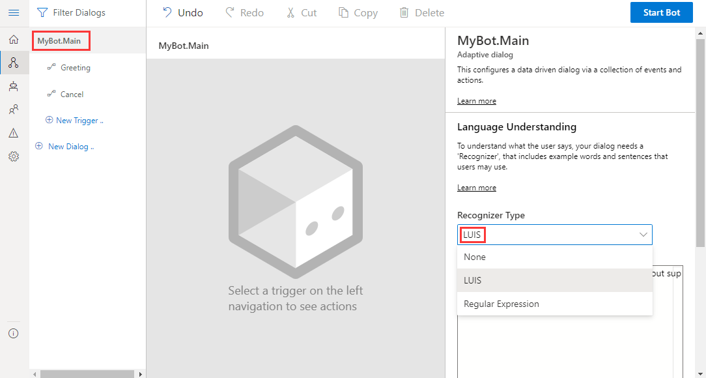
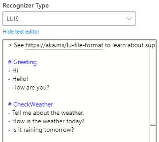
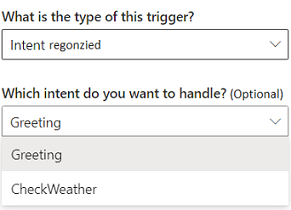

# Language Understanding

Language Understanding (LU) is used by a bot to understand language naturally and contextually to determine what next to do in a conversation flow. In the Bot Framework Composer, the process is achieved through setting up recognizers and providing training data in the dialog so that the **intents** and **entities** contained in the message can be captured. These values will then be passed on to triggers which define how the bot responds using the appropriate actions.

LU has the following characteristics when used in the Bot Framework Composer:

- LU content can be authored in an inline editor or in **User Input** using the [.lu file format](https://github.com/Microsoft/botbuilder-tools/blob/master/packages/Ludown/docs/lu-file-format.md).
- LU content is training data for recognizers. 
- Composer currently supports LU technologies such as LUIS and Regular Expression. 

## Core LU concepts in Composer

### Intents
Intents are categories or classifications of user intentions. An intent represents an action the user wants to perform. The intent is a purpose or goal expressed in the user's input, such as booking a flight, paying a bill, or finding a news article. You define and name intents that correspond to these actions. A travel app may define an intent named "BookFlight."

Here's a simple .lu file that captures a simple **Greeting** intent with a list of example utterances that capture different ways users will express this intent. You can use - or + or * to denote lists. Numbered lists are not supported. 

    # Greeting 
    - Hi 
    - Hello 
    - How are you? 

`#<intent-name>` describes a new intent definition section. Each line after the intent definition are example utterances that describe that intent. You can stitch together multiple intent definitions in a language understanding editor in Composer. Each section is identified by `#<intent-name>` notation. Blank lines are skipped when parsing the file. 

To define and use intents in Composer, you will need to:
1. Setup **LUIS** as recognizer type.
2. Specify intent(s) and example utterances in [.lu file format](https://github.com/microsoft/botbuilder-tools/edit/master/packages/Ludown/docs/lu-file-format.md) as mentioned above.
3. Create an **Intent** trigger to handle each pre-defined intent.
4. Publish the training data to LUIS.

> [!NOTE]
> For additional information on defining intents with the LUIS recognizer and Regular Expression recognizer refer to the [Defining triggers](how-to-defining-triggers.md#intent) article.

### Utterances 
Utterances are input from users and may have a lot of variations. Since utterances are not always well-formed, we need to provide example utterances for specific intents to train bots to recognize intents from different utterances. By doing so, your bots will have some "intelligence" to understand human languages. 

In Composer, utterances are always captured in a markdown list and followed by an intent. For example, the **Greeting** intent with some example utterances are shown in the [Intents](concept-language-understanding.md#intents) section above. 

You may have noticed that LU format is very similar to LG format but there are some key differences. 

- LU is for bots to understand user's input (primarily capture **intent** and more)
- LU is associated with recognizers (LUIS/Regular Expression)
- LG is for bots to respond to users as output 
- LG is associated with a language generator 

### Entities
Entities are a collection of objects, each consisting of data extracted from an utterance such as places, time, and people. Entities and intents are both important data extracted from utterances, but they are different. An intent indicates what the user is trying to do. An utterance may include zero or more entities, while an utterance usually represents one intent. In Composer, all entities are defined and managed inline. Entities in the [.lu file format](https://github.com/microsoft/botbuilder-tools/blob/master/packages/Ludown/docs/lu-file-format.md) are denoted using {\<entityName\>=\<labelled value\>} notation.  For example: 

    # BookFlight
    - book a flight to {toCity=seattle}
    - book a flight from {fromCity=new york} to {toCity=seattle}

The example above shows the definition of a `BookFlight` intent with two example utterances and two entity definitions: `toCity` and `fromCity`. When triggered, if LUIS is able to identify a destination city, the city name will be made available as `@toCity` within the triggered actions or a departure city with `@fromCity` as available entity values. The entity values can be used directly in expressions and LG templates, or stored into a property in [memory](concept-memory.md) for later use. For additional information on entities see the article [advanced intents and entities](how-to-define-advanced-intents-entities.md). 


### Example 
The table below shows an example of an intent with its corresponding utterances and entities. All three utterances share the same intent _BookFlight_ each with a different entity. There are different types of entities, you can find more information in this article on the [LU file format](https://github.com/microsoft/botbuilder-tools/blob/master/packages/Ludown/docs/lu-file-format.md). 

| Intent     | Utterances                                    | Entity                  |
| ---------- | --------------------------------------------- | ----------------------- |
| BookFlight | "Book me a flight to London"                  | "London"                |
|            | "Fly me to London on the 31st"                | "London", "31st"        |
|            | "I need a plane ticket next Sunday to London" | "next Sunday", "London" |

Below is a similar definition of a _BookFlight_ intent with entity specification `{city=name}` and a set of example utterances. We use this example to show how they are manifested in Composer. Extracted entities are passed along to any triggered actions or child dialogs using the syntax `@city`. 

```
# BookFlight
- book a flight to {city=austin}
- travel to {city=new york}
- I want to go to {city=los angeles}
```

After publishing, LUIS will be able to identify a city as entity and the city name will be made available as `@city` within the triggered actions. The entity value can be used directly in expressions and LG templates, or stored into a property in [memory](concept-memory.md) for later use. Read [here](how-to-define-advanced-intents-entities.md) for advanced intents and entities definition.

## Author LU content in Composer

To enable your bot to understand user's input contextually and conversationally so that your bot can decide how to respond to different user inputs, you should author LU as training data.

To author proper LU content in Composer, you need to know:
  - [LU concepts](https://aka.ms/botbuilder-luis-concept?view=azure-bot-service-4.0) 
  - [.lu file format](https://github.com/Microsoft/botbuilder-tools/blob/master/packages/Ludown/docs/lu-file-format.md)
  - [Common Expression Language](https://github.com/microsoft/BotBuilder-Samples/tree/master/experimental/common-expression-language#readme)

To create the LU content, follow these steps:

- Set up a **Recognizer** for a specific dialog (per dialog per recognizer).
- Author LU content as training data in [.lu format](https://github.com/Microsoft/botbuilder-tools/blob/master/packages/Ludown/docs/lu-file-format.md).
- Create **Intent** triggers to wire up the LU content.
- Publish LU content (for LUIS).

### Set up a recognizer
Composer currently supports two types of recognizers: LUIS (by default) and Regular Expressions. This article focuses solely on the LUIS recognizer. Before setting up a recognizer type, you need to select the dialog you will be using for this purpose. In this example you will use the main dialog to set up LUIS as the recognizer type.

1. Select the main dialog in the navigation pane. Then you will see the **Language Understanding** section in the bots properties panel on the right side of the Composer window. select **LUIS** from the **Recognizer Type** drop-down list.
    > [!div class="mx-imgBorder"]
    > 

#### Author LU content 
After you set up the recognizer type, you can customize your LU content in the editor using the [.lu format](https://github.com/Microsoft/botbuilder-tools/blob/master/packages/Ludown/docs/lu-file-format.md).

For this example define two intents: **Greeting** and **CheckWeather** with some example utterances inline: 

> [!div class="mx-imgBorder"]
> 

### Wire up LU content
After you define the intents with example utterances, you need to create **Intent recognized** triggers in the dialog to handle each intent by defining the actions to take when an intent is recognized.

1. Go to your bot's navigation pane on the left side and select **New Trigger**. 

2. In the `Create a trigger` pop-up window, select **Intent recognized** as the type of trigger. Pick the intent you want to handle from the drop-down menu and select **Submit**. 
    > [!div class="mx-imgBorder"]
    > 

3. Click the **User Input** icon in Composer menu. You will see a list of all the LU content you have authored along with details such as which dialog the content is associated with and whether it is published or not.
    > [!div class="mx-imgBorder"]
    > 

### Publish LU

Now the last step is to publish your LU content to LUIS.

1. Select **Start Bot** on the upper right corner of the Composer.

2. Fill in your **LUIS Primary key** and select **OK**.

    > [!Note]
    > If you do not have a LUIS account, you can get one on the [LUIS](https://www.luis.ai/home). If you have a LUIS account but do not know how to find your LUIS primary key please see the [Azure resources for LUIS](https://aka.ms/LUIS-Authoring-Keys#programmatic-key) section of the _Authoring and runtime keys_ article.

3. Select **OK**.
    > [!div class="mx-imgBorder"]
    > 

Any time you select **Start Bot** (or **Restart Bot**), Composer will evaluate if your LU content has changed. If so Composer will automatically make the required updates to your LUIS applications then train and publish them. If you go to your LUIS app website, you will find the newly published LU model.

## References
- [What is LUIS](https://aka.ms/luis-what-is-luis)
- [Language Understanding](https://aka.ms/botbuilder-luis-concept?view=azure-bot-service-4.0)
- [.lu file format](https://github.com/Microsoft/botbuilder-tools/blob/master/packages/Ludown/docs/lu-file-format.md)
- [Common Expression Language](https://github.com/microsoft/BotBuilder-Samples/tree/master/experimental/common-expression-language#readme)
- [Using LUIS for language understanding](https://github.com/microsoft/BotFramework-Composer/blob/kaiqb/Ignite2019/docs/howto-using-LUIS.md)
- [Extract data from utterance text with intents and entities](https://aka.ms/luis-concept-data-extraction?tabs=V2)

## Next 
- Learn how to [use validation](./how-to-use-validation.md).
- Learn how to [send messages to users](how-to-send-messages.md).
